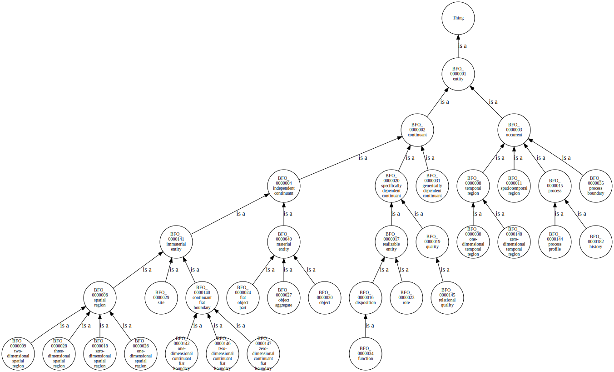

# General Information

This repo collects some code to explore ontologies from Python or Jupyter Notebook.

Installation:

1. clone the repo
2. run `pip install -e .`

# Showcases

## Retrieving the superclasses of a wikidata entity

See also [doc/demo_notebooks/wikidata_superclasses.ipynb](doc/demo_notebooks/wikidata_superclasses.ipynb)

### 3 levels

### 13 levels

## Visualizing the taxonomy of `bfo.owl`

See also [doc/demo_notebooks/bfo_visualization.ipynb](doc/demo_notebooks/bfo_visualization.ipynb):

# Contributing

This repo uses `black -l 120 ./` as base line for coding style .
