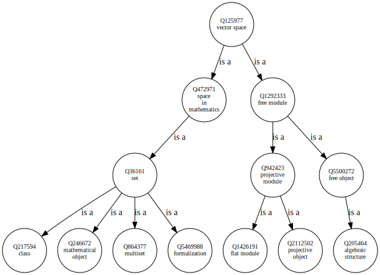
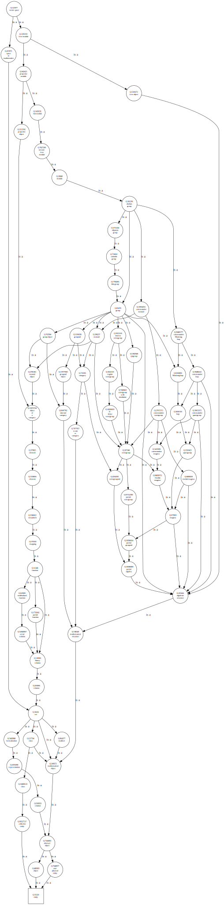

# General Information

This repo collects some code to explore ontologies from Python or Jupyter Notebook.

# Showcase

See [doc/demo_notebooks](doc/demo_notebooks).

Retrieving the superclasses of a wikidata entity:

### 3 levels

### 13 levels

# Contributing

This repo uses `black -l 120 ./` as base line for coding style .
